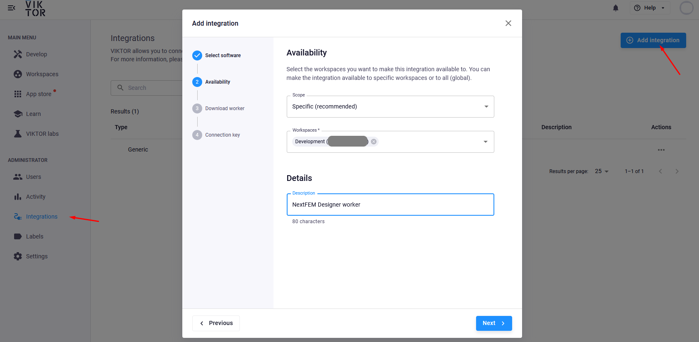
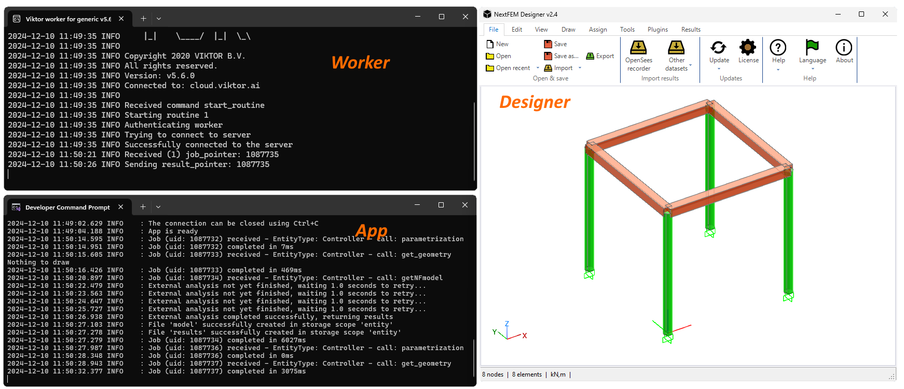

# NextFEM-VIKTOR integration

## Prerequisites
- You need a free VIKTOR account. Register in order to get a VIKTOR workspace
- NextFEM Designer has to be installed on your machine. You don't need a NextFEM license to use the sample code below, free version allows you to run analyses with no limits!

## Installation instructions

1. install VIKTOR locally (you should be able to run viktor-cli in a command shell).

2. obtain the source code of NextFEM app from our Github repo, you can donwload as a zip or clone the repo with the command
`git clone https://github.com/NextFEM/VIKTOR-integration.git`

3. inside the repository, use the folder NextFEM-VIKTOR

4. start the app with the command
`viktor-cli clean-start`


5. log-in into cloud.viktor.ai and open your Development workspace, or click in the link provided in the shell log. You'll get a blank workspace, hence click Create and then assign a name to the new app.


6. when you're done, click on Open


7. Now set up your local worker. A worker is able to connect your local copy of NextFEM Designer to VIKTOR cloud. From site cloud.viktor.ai, select Integrations, and Add integration. Select Generic worker, set scope as Specific and give it a name. The guided procedure let you download the worker installer and assign to you a key that must be used during installation on your machine.



8. We're almost ready! Set your worker configuration in config.yaml like this, by changing [username] with your username. In addition, set a scratch folder folder for the worker (e.g. create a folder named NextFEM_models in drive C:).
```
# CONFIGURATION FILE FOR VIKTOR WORKER TO RUN GENERIC EXECUTABLE / SCRIPT
#
executables: 
  get_model: 
    path: 'C:\Users\[username]\AppData\Local\Programs\Python\Python313\python.exe'
    arguments:
      - 'get-model.py'
    workingDirectoryPath: 'C:\NextFEM_models' 
maxParallelProcesses: 1
```
9. Finally, start the worker. We're almost ready! Remember also to start NextFEM Designer and the plugin REST API server.


## Usage

The sample code provided is aimed to share easily models and results. One the app is running and the worker is connected, press Reload model and wait for execution. Then, click on the three dots in the upper-right corner of the viewport and select Center camera.


What happens when the button Reload model is pressed? The local worker executes the code in get-model.py. Your local copy of NextFEM Designer receives instructions and collects the model, running the analyses for the specified load cases. 
Here's what you can see in your machine: the command prompt in which the app runs, the worker and NextFEM Designer with the computed model.



Finally, model and results are sent to VIKTOR; viewport and results table are populated.


The power of VIKTOR approach is allowing models and data to be shared and visualized with ease. With a bunch of Python lines, you can:
- run Finite Element analysis for free in VIKTOR platform
- share the analysis results and compile custom views as well
- develop any application working with your local copy of NextFEM Designer, including planar meshing with shell elements, model sanity checks on nodes and elements, and checking as per European design codes if you have a proper license.
